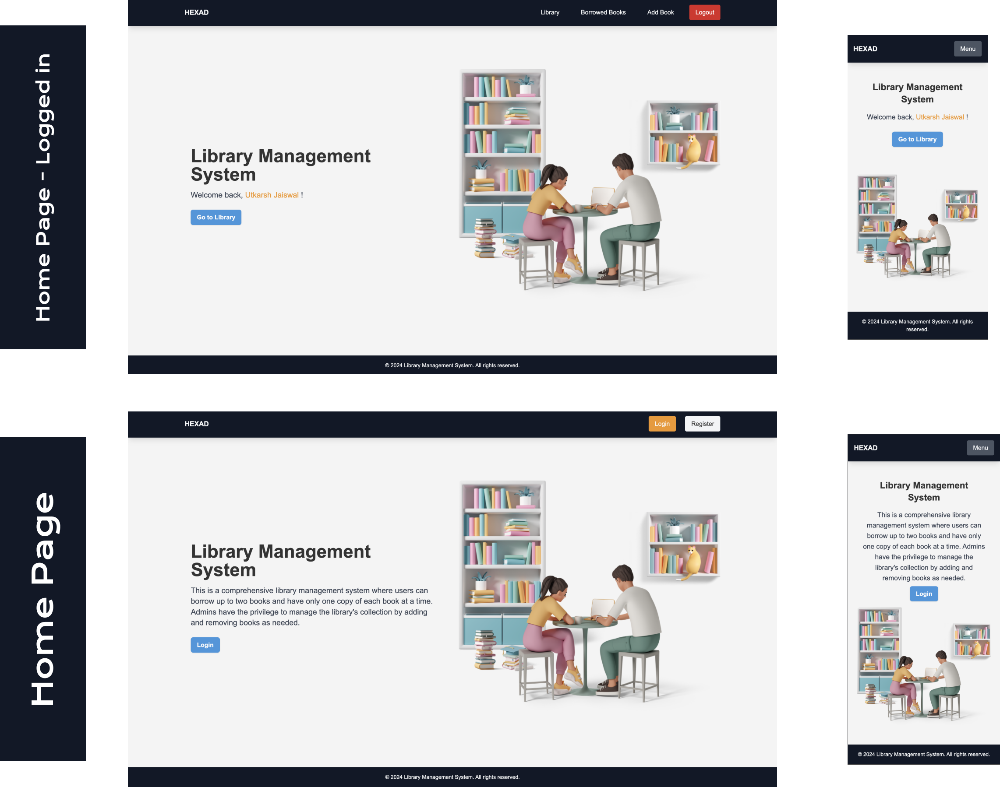
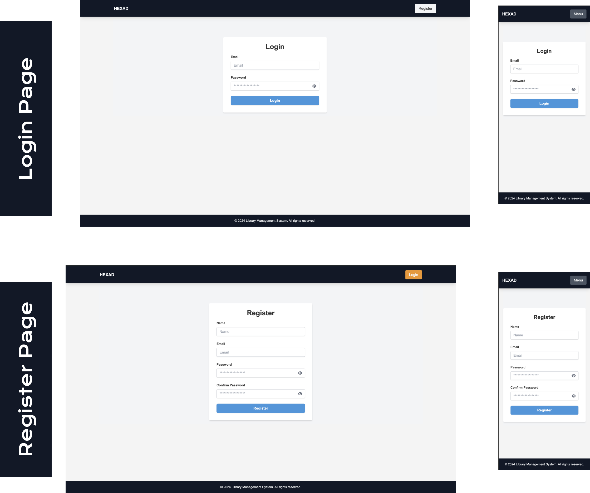
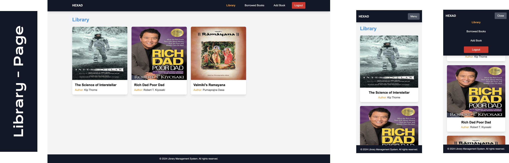
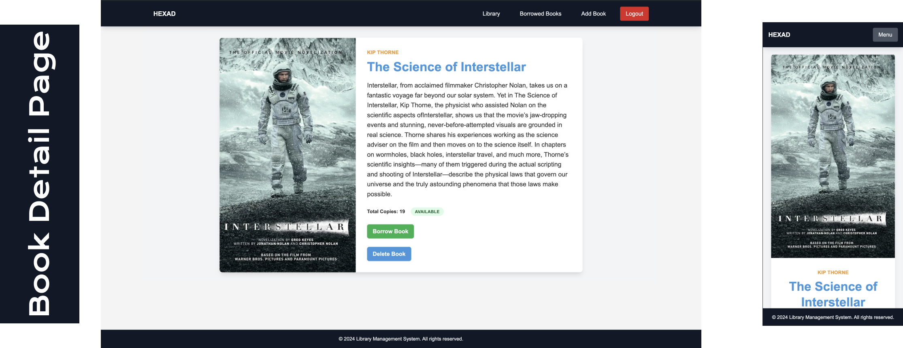
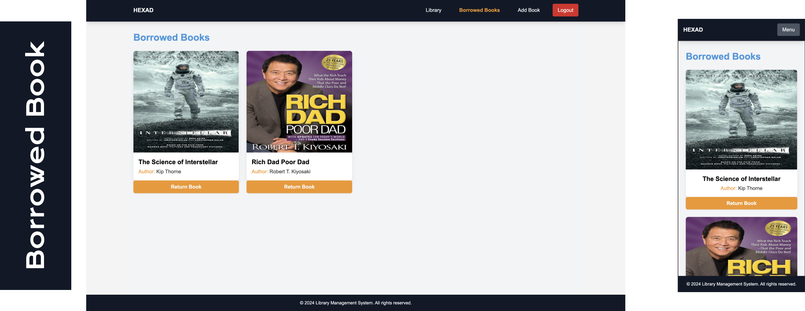
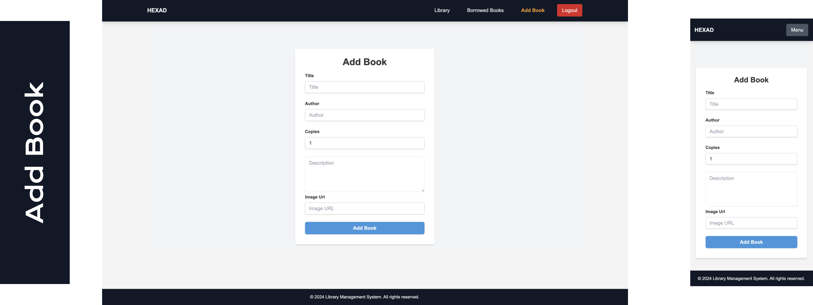
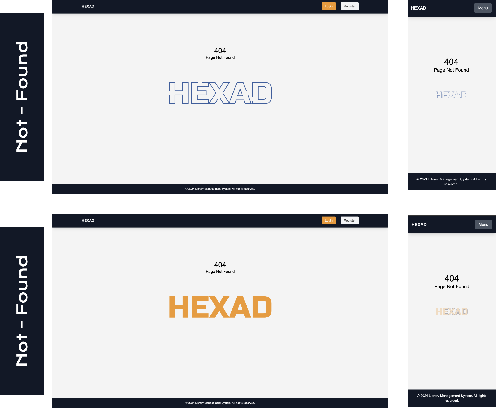

# Library Management System

The Library Management System is a robust application built using the MERN stack (MongoDB, Express.js, React.js, Node.js), designed to efficiently manage library operations.

This README.md file includes detailed architectural decisions, thoughts, and assumptions made during the development process to provide better insight into the design and implementation of the system.

## Screenshots

Attach screenshots of the application in action:

### Home Page



### Login-SignUp Page



### Library Page



### Book-detail Page



### Borrowed Book Page



### Add Book Page



### Not Found Page



## Website credentials and URL

- Admin:
  • Email: admin@gmail.com
  • Password: 123456
  • User:
  • Email: test@gmail.com
  • Password: 123456

You can visit the live version of the Library Management System [here](https://library-management-fullstack-app.vercel.app/)
[Library Management System](https://library-management-fullstack-app.vercel.app/)

## Architectural Approach

This project has been developed with a strong emphasis on clean, maintainable, and testable code. The following principles and methodologies have been central to the design and implementation:

### Clean Code

- Clear and meaningful naming conventions for variables, functions, and classes.
- Functions are designed to perform a single task, making them easier to test and maintain.
- The code is modularized, making it easy to understand, extend, and refactor.

### SOLID Principles

**The system adheres to SOLID principles:**

- Single Responsibility Principle: Each module/class has a single responsibility, making the system easier to manage and understand.
- Open/Closed Principle: The system is designed to be open for extension but closed for modification.
- Liskov Substitution Principle: Objects of a superclass can be replaced with objects of a subclass without affecting the correctness of the program.
- Interface Segregation Principle: No client is forced to depend on methods it does not use.
- Dependency Inversion Principle: High-level modules do not depend on low-level modules but on abstractions.

## KISS (Keep It Simple, Stupid)

- The project embraces the KISS principle, ensuring that the design is as simple as possible. Complexities are avoided unless absolutely necessary, making the system easier to maintain and understand.

### DRY (Don't Repeat Yourself)

- DRY principles have been followed to avoid code duplication. Common functionality is abstracted into reusable components, reducing redundancy and improving maintainability.

### Features

- User Authentication, Authorization and Registration
- Book Management (CRD operations)
- User Role Based Management ( user | admin )
- Borrowing and Returning Books ( at max two book at a time )
- Responsive UI
- Axios interceptor for refreshing tokens
- Lazy loading
- Image optimization

### Installation

1. Clone the repository:

```
  git clone https://github.com/utkarshjaiswal0004/Library-Management-Fullstack-App.git
```

2.  Install dependencies for frontend:

```
  cd Library-Management-Fullstack-App/frontend
  npm install
```

3.  Set up environment variables:

- Create a .env file in the frontend directory and add the following:

```env

VITE_REACT_APP_API_URL=<YOUR-BACKEND-URL>/api/

```

4. Start the development servers:

-     Frontend (from inside frontend folder):

```
npm run dev
```

### Usage

After installation, you can access the application locally via http://localhost:3000. Use the following credentials for testing (if any):

- Admin:
  • Email: admin@gmail.com
  • Password: 123456
  • User:
  • Email: test@gmail.com
  • Password: 123456
